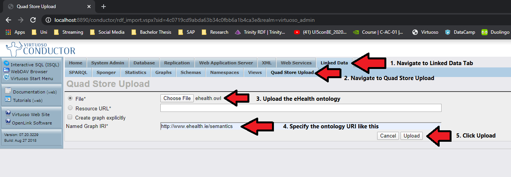
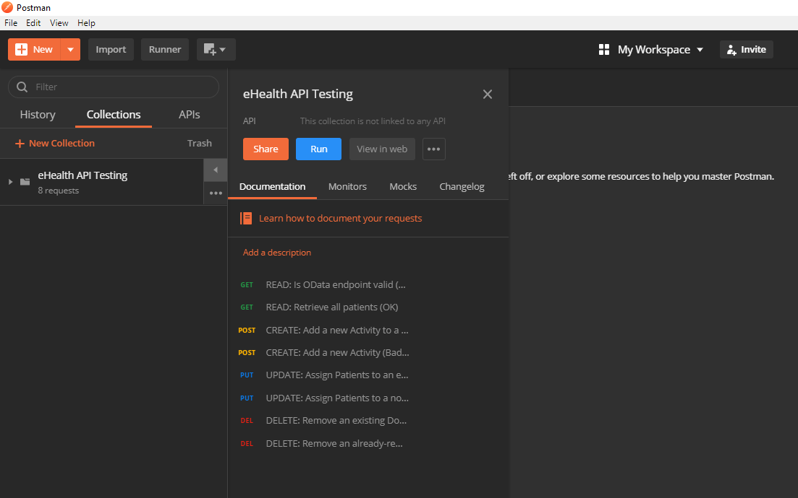

# eHealth Data Integration Layer (DIL)
The eHealth Data Integration Layer (DIL) is an intermediate SOA-based (Service-oriented Architecture) layer for managing the data traffic between both frontend and backend sources on the basis of CRUD. It enables the ability to import/export data from one source to another, or vice versa. The backend system integrated by the DIL is a semantic database which uses the [Semiodesk Trinity](https://trinity-rdf.net/) library in order to maintain the connection based on the ODBC (Open Database Connectivity) standard. [OData](https://www.odata.org/) (Open Data Protocol) is an extended communication protocol to Web APIs on the DIL which exposes every CRUD operation to each entity.

## Prerequisites
- ASP.NET Core 3.1
- [OpenLink Virtuoso](http://vos.openlinksw.com/owiki/wiki/VOS/VOSDownload)

## 1. Preamble
*It is recommended to clone the entire eHealth repository comprising of the frontend as well as the backend applications.*

Before starting the deployment, clone this repository. After cloning, ensure that the repository folder is inside your personal GitHub directory. Then follow through this instruction sequentially.

## 2. Deploying Virtuoso
Prior to deploying the DIL, it is important that Virtuoso is installed. To do so, download and install the database using the .exe file.

To verify the deployment of Virtuoso, access the platform on http://localhost:8890.

## 3. Deploying the eHealth Ontology on Virtuoso
On the bar located on the left-hand side of the page, click on "Conductor". Then, use the base credentials "dba" for both "Account" and "Password" in order to login.

Click on the "Linked Data" tab and then click on the "Quad Store Upload" subtab. Select the
"ehealth.owl" file located inside the eHealth-DataBus/ontologies directory and change the "Named Graph IRI" to "http://www.ehealth.ie/semantics". Click on the "Upload" button. The whole procedure is visualised in this screenshot below:



To verify the deployment of the ontology, navigate to the "SPARQL" subtab. Specify "http://www.ehealth.ie/semantics" as "Default Graph IRI" and issue the following test query:
```
SELECT * WHERE { ?s ?p ?o. }
```

The whole procedure is visualised in this screenshot below:


If the query presents the whole ontology as triples then the deployment is successful.

## 4. Deploying the DIL

Issue the following commands for launching the DIL in localhost mode:
```
cd eHealth-DIL-3.1
dotnet run
```
To access the DIL via IPV4 Address, issue the following commands:
```
cd eHealth-DIL-3.1
dotnet run --urls https://0.0.0.0:5001
```

To verify the deployment of the DIL, access the platform on https://localhost:5001/odata.

## 5. Consuming OData
To consume OData, the DIL's endpoint (https://localhost:5001/odata) must be specified on an OData Client. Services like SAP's open-source Web Framework [OpenUI5 (JavaScript)](https://openui5.org/), [o.js (JavaScript)](https://github.com/janhommes/o.js), or [Simple.OData.Client (C#)](https://github.com/simple-odata-client/Simple.OData.Client) have built-in OData client capabilities that take advantage of the OData metadata in order to unleash its full data management potential. However, since the DIL is developed in ASP.NET Core, the Web API remains as a viable backdrop option since OData is an extension to it. The frontend application of the eHealth system uses o.js for consuming OData. Refer to the documentation of the example services mentioned in this section that detail the means of consuming OData.

An example which demonstrates the consumption of OData via the Web API backdrop looks as follows in Postman:


It is important to know the data model of the DIL in order to consume OData. OData in general requires an Entity-Data-Model (EDM) in order to map the data to their corresponding model. Since OData consists of a metadata document, it exposes the entire data model. It is possible to access the metadata via the [endpoint](https://localhost:5001/odata) by its key ["@odata.context"](https://localhost:5001/odata/$metadata).

Each entity has four methods that represent CRUD operations:
| Method   | Query Parameter | Body   |
|:--------:|:---------------:|:------:|
| Create   | N/A             | Entity |
| Read     | N/A             | N/A    |
| Update   | ID              | Entity |
| Delete   | ID              | N/A    |

To specify the relationship from one entity to another, it must be specified as follows:

```
{
    "Name": "Dr. Max Mustermann"
    "Patients": [{
        "ID": "Patient-123456789"
    }]
}
```
## 6. Integration Testing
To perform Integration Testing against the DIL, it is best advised to download [Postman](https://www.postman.com/) which contains an integrated testing suite. Inside the ["Postman-IntegrationTest"](https://github.com/bluiska/eHealthApplication/tree/feature/DIL/eHealth-DIL/Postman-IntegrationTest) directory, there are two files:
1. eHealth-API-Testing-Script.postman_test_run.json *(Actual script with test cases)*
2. eHealth-API-Testing-Results.postman_test_run.json *(Test results from 1.)*

The JSON test script detailed in 1. can be imported to Postman. After importing the script, every test case can be executed with one click, provided the DIL active. The following screenshot demonstrates how to run the tests:



After running the script, the results screen will look as follows:


