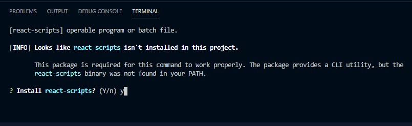

## React

Developed by Facebook, React is a Javascript library that builds single page user interfaces for single-page applications.
React provides a component based structure. Components are like jigsaw pieces. It allows us to design simple components, then wrap and compose those components to produce more complex components.
React use a virtual DOM to render the components to the page. This maximises the performance of the application, as only the states that are updated are rerendered to the page.

reference: https://stories.jotform.com/7-reasons-why-you-should-use-react-ad420c634247

## Ionic

The Ionic framework allows us to build applications once and run it on Web, Android and iOS devices. As such, we only need to learn one programming language and we're able to deploy the application to multiple platforms.
Ionic also comes with in-built UI components which drastically cuts down on the time it takes to style the application.

## Deploying eHealth application

Prior to deploying the ehealth application, it is important that npm is installed. To do so, cd into the \eHealthApplication\eHealthApp directory and run the following command

```
npm i
```

This will install all the dependencies that are needed to run the application.

To deploy the eHealth application, you need to ensure that you are in the \eHealthApplication\eHealthApp directory and run the following command:

```
ionic serve
```

You might be prompted about if you wish to install react-scripts at which point you should type in 'y' and press enter.


If the deployment failed and you receive a 'BrowserslistError' error, you will need to delete the following files from the directory: browserslist, browserslist.cmd, browserslist.ps1.
Run the 'ionic serve' command once more and the application should successfully deploy

Once deployed, the application will automatically be displayed on the scrren running on http://localhost:8100/.

## Testing

Prior to running the unit tests, it is important npm is installed. To do so, cd into the \eHealthApplication\eHealthApp directory and run the following command

```
npm install
```

This will install all the dependencies that are needed to run the application.

To run the tests for the eHealth application, you need to ensure that you are in the \eHealthApplication\eHealthApp directory and run the following command:

```
npm test
```

Once the command is ran, all the unit tests will start running with the results being displayed on the console.
